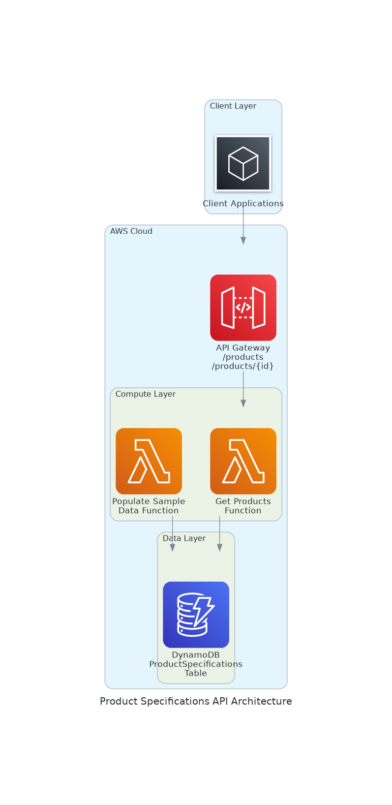

# Product Specifications API

A serverless REST API for accessing product specifications with flexible JSON schema storage, built using AWS CDK, Lambda, DynamoDB, and API Gateway.

## Architecture



The system follows a serverless architecture pattern:

- **API Gateway**: RESTful API endpoint management and request routing
- **Lambda Functions**: Serverless compute for business logic
- **DynamoDB**: NoSQL database for flexible JSON document storage
- **CloudFormation/CDK**: Infrastructure as Code for deployment

## API Endpoints

### Base URL
```
https://g9v5wrlga8.execute-api.us-east-1.amazonaws.com/prod/
```

### Endpoints

#### Get All Products
```http
GET /products
```

**Response:**
```json
{
  "products": [
    {
      "productId": "prod-001",
      "name": "Wireless Bluetooth Headphones",
      "category": "Electronics",
      "brand": "TechSound",
      "specifications": {
        "color": "Black",
        "batteryLife": "20 hours",
        "connectivity": ["Bluetooth 5.0", "3.5mm jack"],
        "weight": "250g",
        "features": ["Noise Cancellation", "Quick Charge"]
      },
      "createdAt": "2025-10-01T22:48:07.093Z",
      "updatedAt": "2025-10-01T22:48:07.093Z"
    }
  ]
}
```

#### Get Product by ID
```http
GET /products/{productId}
```

**Response:**
```json
{
  "productId": "prod-001",
  "name": "Wireless Bluetooth Headphones",
  "category": "Electronics",
  "brand": "TechSound",
  "specifications": {
    "color": "Black",
    "batteryLife": "20 hours",
    "connectivity": ["Bluetooth 5.0", "3.5mm jack"],
    "weight": "250g",
    "features": ["Noise Cancellation", "Quick Charge"]
  },
  "createdAt": "2025-10-01T22:48:07.093Z",
  "updatedAt": "2025-10-01T22:48:07.093Z"
}
```

**Error Response (404):**
```json
{
  "error": "Product not found"
}
```

## Sample Data

The API comes pre-populated with three sample products:

1. **Wireless Bluetooth Headphones** (Electronics)
2. **Smart Fitness Watch** (Wearables)
3. **Organic Coffee Beans** (Food & Beverage)

Each product demonstrates the flexible JSON schema capability with different specification attributes.

## Testing the API

### Using curl

```bash
# Get all products
curl "https://g9v5wrlga8.execute-api.us-east-1.amazonaws.com/prod/products"

# Get specific product
curl "https://g9v5wrlga8.execute-api.us-east-1.amazonaws.com/prod/products/prod-001"

# Test error handling
curl "https://g9v5wrlga8.execute-api.us-east-1.amazonaws.com/prod/products/non-existent"
```

## Project Structure

```
product-specs-api-01102025-1836/
├── specs/
│   ├── requirements.md          # User stories and acceptance criteria
│   ├── design.md               # Technical architecture documentation
│   └── tasks.md                # Implementation plan and progress
├── cdk-app/                    # CDK application
│   ├── lib/
│   │   └── cdk-app-stack.ts    # Main CDK stack definition
│   ├── bin/
│   │   └── cdk-app.ts          # CDK app entry point
│   └── package.json            # Node.js dependencies
├── generated-diagrams/
│   └── product-specs-api-architecture.png
└── README.md
```

## Deployment

The infrastructure is deployed using AWS CDK:

```bash
cd cdk-app
npm install
npm run build
npx cdk deploy
```

## AWS Resources Created

- **DynamoDB Table**: `product-specs-{timestamp}` - Stores product specifications
- **Lambda Functions**:
  - `GetProductsFunction` - Handles API requests
  - `PopulateDataFunction` - Populates sample data
- **API Gateway**: REST API with CORS enabled
- **IAM Roles**: Least privilege access for Lambda functions

## Features

- **Flexible JSON Schema**: Products can have any specification attributes
- **CORS Enabled**: Ready for web client integration
- **Error Handling**: Proper HTTP status codes and error messages
- **Serverless**: Scales automatically with demand
- **Cost Effective**: Pay-per-request pricing model
- **Secure**: Encryption at rest and least privilege IAM policies

## Performance

- **Response Time**: < 2 seconds for API requests
- **Scalability**: Handles concurrent requests automatically
- **Availability**: Multi-AZ deployment through AWS services

## Specifications

This project follows specification-driven development with:

- **Requirements**: User stories with EARS notation acceptance criteria
- **Design**: Technical architecture and sequence diagrams
- **Tasks**: Discrete implementation steps with progress tracking

All specifications are located in the `specs/` directory.
